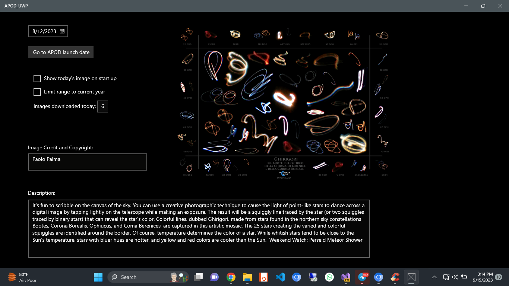
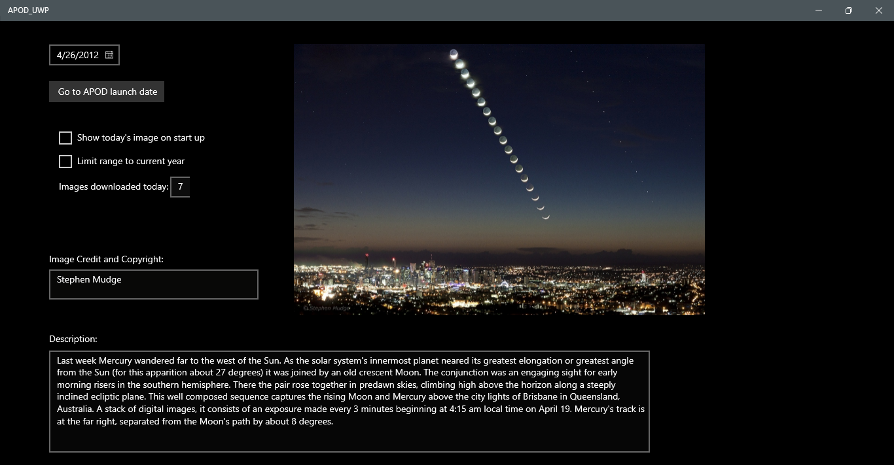

# Astronomy Picture of the Day (APOD) UWP Application



## Table of Contents
- [Overview](#overview)
- [Features](#features)
- [Getting Started](#getting-started)
  - [Prerequisites](#prerequisites)
  - [Installation](#installation)
- [Usage](#usage)
- [Contributing](#contributing)
- [License](#license)

---

## Overview

The **Astronomy Picture of the Day (APOD) UWP Application** is a Universal Windows Platform (UWP) desktop application built using Visual Studio. It provides users with access to NASA's Astronomy Picture of the Day API, allowing them to view and explore stunning astronomy images and their descriptions.

## Features

- **Date Selection:** Users can select a specific date to view the Astronomy Picture of the Day for that date.

- **Date Range Limitation:** The application offers an option to limit the date range to the current year, ensuring users can explore recent images.

- **Image Display:** The selected image is displayed along with its copyright information.

- **Description:** A detailed description of the featured image is provided, enhancing the user's understanding.

- **Startup Preference:** Users can choose to have the app display today's image automatically upon startup.

- **Download Tracking:** The application keeps track of the number of images downloaded today.

---

## Getting Started

### Prerequisites

Before you begin, ensure you have met the following requirements:

- **Visual Studio:** You'll need Visual Studio with UWP development tools installed.

- **NASA API Key:** Obtain an API key from [NASA's API Portal](https://api.nasa.gov/) to access the Astronomy Picture of the Day API.

### Installation

- **Clone the Repository:**

   ```bash
   git clone https://github.com/your-username/APOD_UWP.git


## Open the Project

- Launch Visual Studio.
- Open the cloned project.

## Configure API Key

- Locate the `RetrievePhoto` method in `MainPage.xaml.cs`.
- Replace `"DEMO_KEY"` with your NASA API key.

## Build and Run

- Build the application.
- Run the application to launch the APOD UWP app.

## Usage

Follow these steps to effectively use the APOD UWP application:

### Launch the Application

- Open the APOD UWP app.

### Select a Date

- Use the calendar to choose a specific date for which you want to view the Astronomy Picture of the Day.

  

### Limit Date Range (Optional)

- Check the "Limit range to current year" option if you want to restrict the date range to the current year.

### Go to Launch Date (Optional)

- Click the "Go to APOD launch date" button to navigate back to the launch date of APOD (June 16, 1995).

### Explore the Image

- The selected image, along with its copyright information, will be displayed on the interface.

### Read the Description

- A detailed description of the featured image is available for you to read and learn more about the astronomy subject.

### Automatic Image Display (Optional)

- If you enable the "Show today's image on startup" option, the app will automatically display today's Astronomy Picture of the Day when launched.

### Track Downloads

- The application keeps count of the number of images downloaded today, which is displayed for your reference.

## Contributing

Contributions to this project are highly welcomed. If you wish to contribute, follow these steps:

1. **Fork the Repository:** Click the "Fork" button on the top right of this repository to create your own copy.

2. **Create a Branch:** Create a new branch with a descriptive name for your feature or bug fix.

3. **Make Changes:** Make your desired changes within the branch, ensuring clear and concise commit messages.

4. **Push to Your Fork:** Push your changes to your forked repository.

5. **Create a Pull Request:** Open a pull request to propose your changes for merging into the main project.

6. **Review and Collaboration:** Your pull request will be reviewed, and collaboration with other contributors may be required.

## License

This project is licensed under the MIT License.
